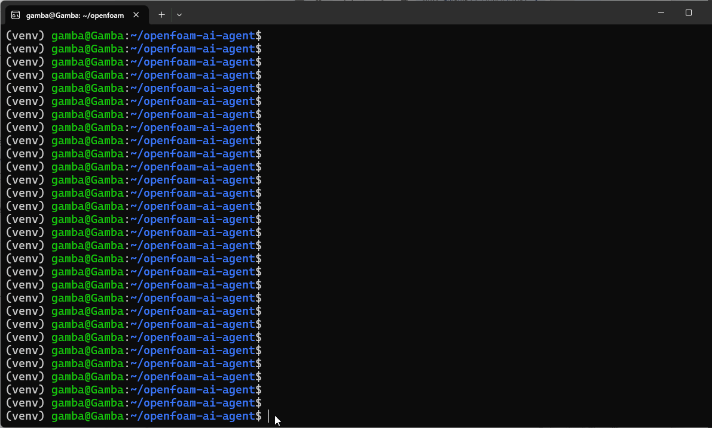

# OpenFOAM AI Agent

自然言語で OpenFOAM ケースを生成・修正・実行できる**対話型エージェント**です。ケースディレクトリをワークスペースとして開き、チャットで指示すると、ファイルの読み書き・ソルバー実行・エラー修正を繰り返します。

**位置づけ:** OpenFOAM 版 Cursor — ユーザーと対話しながらケースを育て、実行と自己修復をループするエージェント。



*controlDict の不正値を検出し、エラーログから原因を特定して自動修正、再実行して完走するまでの一連の流れ*

<!--  後日追加 -->

---

## できること（v2・検証済み）

1. **新規ケース生成から実行まで** — 空のワークスペースに「円柱周り 2D カルマン渦、流入 0.15 m/s、層流」などと指示 → `case_scaffold` でケース生成 → `blockMesh` → ソルバー実行まで対話で到達
2. **既存ケースの差分編集と再実行** — 生成済みケースを開き「流入速度を 0.3 m/s に」「endTime を 50 s に」などと指示 → `0/U` や `system/controlDict` を str_replace で最小差分編集 → 再実行（ゼロから再生成しない）
3. **自己修復** — 意図的に壊した dict を持つケースで「実行して、落ちたら直して」→ `read_log(errors)` で原因特定 → `edit_file` で修正 → 再実行して完走

編集・実行・ケース生成の前には確認ゲート（diff / コマンド表示 → y/n）が入ります。`--yolo` で確認を省略できます。

---

## v1 → v2 の設計転換

v1 は 4 エージェントの固定パイプライン（Preprocessing → RAG → OpenFOAM GPT → Post-processing）を `run` コマンド 1 発で回す構成でした。

v2 ではこのパイプラインを解体し、**判断ループは AgentCore 1 体に集約**しました。v1 の各エージェントは独立した判断主体ではなく、ツールまたはツール内部実装として再利用します。

| v1 | v2 |
|---|---|
| Agent① Preprocessing | `case_scaffold` の内部処理 |
| Agent② RAG | `rag_search` ツール |
| Agent③ OpenFOAM GPT | 解体（生成 → `case_scaffold`、実行・修正 → AgentCore） |
| Agent④ Post-processing | Phase 2 予定の `summarize_results` 等 |

`run` コマンド（v1 互換）は温存しており、両モードを併用できます。

---

## 使い方

### chat モード（v2・対話型）

```bash
source venv/bin/activate
python -m src.main chat --workspace ./output/my_case
```

| オプション | 説明 |
|-----------|------|
| `--workspace`, `-w` | ケースディレクトリ（必須） |
| `--resume` | `.ofagent/session.json` から前回セッションを復元 |
| `--yolo` | 編集・実行の確認ゲートを省略（既定は確認あり） |

**対話例（新規生成）**

```
> 2D 円柱周りのカルマン渦、流入 0.15 m/s、層流でケースを作って実行して
[tool] case_scaffold '2D 円柱周りのカルマン渦...'
実行しますか? [y/n]: y
[tool] run_openfoam blockMesh
...
[tool] run_openfoam pimpleFoam
```

**対話例（パラメータ変更）**

```
> 流入速度を 0.3 m/s に変えて再実行して
[tool] read_file 0/U
[tool] edit_file 0/U          ← diff 表示 → y/n
[tool] run_openfoam pimpleFoam
```

**対話例（自己修復）**

```
> pimpleFoam を実行して。落ちたらログを見て直して
[tool] run_openfoam pimpleFoam
[tool] read_log log.pimpleFoam mode=errors
[tool] edit_file system/controlDict
[tool] run_openfoam pimpleFoam
```

**スラッシュコマンド:** `/status`（spec・実行履歴）、`/yolo`（確認省略の切替）、`/quit`

### run モード（v1 互換・単発実行）

自然言語 1 行から生成 → メッシュ → ソルバー → レポートまで 4 エージェントパイプラインを一括実行します。

```bash
# カルマン渦 Re=1000（非対話・MPI 4 並列）
python -m src.main run \
  "2D円柱周りのカルマン渦 Re=1000 層流 流入速度1m/s" \
  -o ./output/karman_re1000 \
  --no-interactive --parallel --np 4

# 短時間プレビュー（5 周期 = 25 s）
python -m src.main run \
  "2D円柱 Re=1000 カルマン渦" \
  -o ./output/karman_demo --no-interactive --demo
```

| コマンド | 説明 |
|---------|------|
| `run` | フルパイプライン（生成 → 実行 → レポート） |
| `continue-run` | 既存ケースを latestTime から endTime まで再開 |
| `reconstruct` | 並列計算後の processor* を全タイムステップ復元 |
| `build-index` | チュートリアル RAG インデックス構築 |
| `test-agents` | Agent 間通信テスト（`--offline` / `--all`） |
| `check` | 既存ケースの AI レビュー |

`run` の主なオプション: `-o` 出力先、`--no-interactive`、`--parallel` / `--np`、`--demo` / `--periods`、`--stl`（snappyHexMesh 用 STL）

---

## アーキテクチャ

```
┌────────────────────────────────────┐
│ UI 層         cli_chat.py (REPL)   │
├────────────────────────────────────┤
│ Agent 層      AgentCore            │
├────────────────────────────────────┤
│ Tool 層       tools/*.py           │
├────────────────────────────────────┤
│ Domain 層     runner, monitor, rag,│
│               case_builder, models │
└────────────────────────────────────┘
```

### ツール一覧

| 分類 | ツール | 概要 |
|------|--------|------|
| **fs** | `list_files` | ワークスペース配下のツリー表示 |
| | `read_file` | テキストファイル読み取り |
| | `edit_file` | str_replace 方式の差分編集 |
| | `write_file` | 新規ファイル作成（既存は拒否） |
| **foam** | `run_openfoam` | 許可リスト内の OpenFOAM コマンド実行 |
| | `read_log` | ログ読取（errors / tail / residuals） |
| | `foam_dict_check` | `foamDictionary` による構文チェック |
| **case** | `case_scaffold` | 自然言語からケース一式を生成（実行はしない） |
| **rag** | `rag_search` | ChromaDB ベクトル検索（case スコープ） |

---

## 安全機構

- **確認ゲート** — `edit_file` / `write_file` / `run_openfoam` / `case_scaffold` の前に diff またはコマンドを表示し y/n で確認。既定は確認あり、`--yolo` または REPL 内 `/yolo` でオプトイン
- **str_replace 編集** — `edit_file` は `old_str` がファイル内に 1 回だけ出現する場合のみ置換。曖昧な編集はエラーで LLM に再考させる
- **dict 構文チェック** — `0/`, `system/`, `constant/` 配下を `edit_file` した後、自動で `foamDictionary` チェックを実行
- **許可リスト実行** — `run_openfoam` は `blockMesh`, `snappyHexMesh`, `checkMesh`, `simpleFoam`, `pimpleFoam` 等の OpenFOAM コマンドのみ。任意シェル実行は不可
- **ワークスペース制限** — すべてのツールは `--workspace` 配下のみ操作可（パストラバーサル拒否）

---

## RAG

OpenFOAM v2512 チュートリアルを **1 ケース = 1 ドキュメント**として ChromaDB にインデックス化しています（477 ケース）。

- **`case_scaffold` 時** — 類似チュートリアルケースを参照して生成方針を決定
- **ループ中** — `rag_search`（case スコープ）で設定例・記法を参照

初回はインデックス構築が必要です:

```bash
python -m src.main build-index --no-web
```

インデックスは `knowledge_base/chroma_db/` に保存されます（`.gitignore` 対象）。

---

## 環境

| 項目 | バージョン |
|------|------------|
| OS | Ubuntu 24.04 on WSL2 推奨 |
| Python | 3.12+ |
| OpenFOAM | v2512（`/usr/lib/openfoam/openfoam2512`） |
| LLM | 既定 OpenAI **gpt-4o**（`.env` で切替可） |

```bash
# .env の例
LLM_PROVIDER=openai
OPENAI_API_KEY=sk-...
LLM_MODEL=gpt-4o

# Anthropic を使う場合
# LLM_PROVIDER=anthropic
# ANTHROPIC_API_KEY=sk-ant-...
# LLM_MODEL=claude-sonnet-4-20250514
```

---

## セットアップ

```bash
git clone https://github.com/GambaKitaike/openfoam-ai-agent.git
cd openfoam-ai-agent
bash setup.sh                 # venv 作成 + pip install -e .
source venv/bin/activate

cp .env.example .env          # OPENAI_API_KEY を設定

python -m src.main build-index --no-web   # RAG インデックス（初回）

mkdir -p output/my_case
python -m src.main chat --workspace ./output/my_case
```

> コマンドはプロジェクトルートから実行してください。`pip install -e .` 後は `openfoam-agent chat ...` も使えます。

---

## 収束の鉄則

エージェントのシステムプロンプトに組み込まれている OpenFOAM 運用知識の要点:

- blockMesh 単独では noSlip 壁パッチが 1 つ以上必要
- 壁あり内部流れ → SIMPLEC + linearUpwind → 50〜300 step で定常収束が目安
- 2D 円柱・カルマン渦: 上下境界は **slip / zeroGradient**（symmetryPlane は使わない）
- Re のみ指定時は U = 1 m/s 固定、ν = U·L/Re で整合
- 非定常: blockMesh → checkMesh 後に Δt = maxCo × Δx / U（maxCo=0.5）、`adjustTimeStep yes`

---

## 対応 case_type

| `case_type` | 説明 |
|-------------|------|
| `channel_2d` / `channel_3d` | 壁あり内部流れ |
| `cylinder_2d_ogrid` | O-グリッド円柱（カルマン渦、STL 不要） |
| `snappy_2d` / `external_snappy` | STL + snappyHexMesh |

---

## ParaView（WSL → Windows）

```bash
touch output/<case>/<case>.foam
```

Windows エクスプローラー:

```
\\wsl.localhost\Ubuntu-24.04\home\<user>\openfoam-ai-agent\output\<case>\<case>.foam
```

並列計算後の復元は `run --parallel` 完了時に自動実行されます。手動の場合:

```bash
python -m src.main reconstruct ./output/<case>
```

---

## テスト

```bash
source venv/bin/activate
pytest tests/ -q
```

---

## Roadmap（未実装）

以下は設計済みですが、**現バージョンでは未実装**です。

### Phase 2: 結果要約の強化

- 残差グラフ（`plot_residuals`）
- 力係数 Cd/Cl 算出（`compute_forces`）
- 統合レポート `report.md` 生成（`summarize_results`）
- 断面コンター画像（`render_snapshot`）
- 実行履歴からの失敗事例 DB 蓄積

### Phase 3: Streamlit Web UI

- ブラウザ上のチャット UI
- diff の Accept/Reject ボタン
- 残差グラフ・スナップショットのインライン表示

---

## ライセンス

MIT
