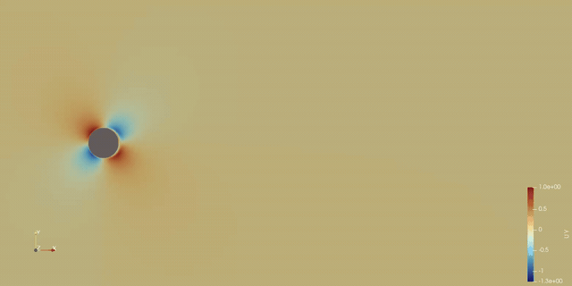

# OpenFOAM AI Agent

自然言語の指示から OpenFOAM 解析ケースを自動生成・実行・可視化まで一括で行う AI エージェントです。

**目標:** OpenFOAM 版 Cursor — ユーザーと対話しながらケースを育て、実行・エラー修正を繰り返すエージェント（現在は検証段階のプロトタイプ）。

### デモ: カルマン渦（Re=1000）

2D 円柱 O-グリッド / `pimpleFoam`（層流）/ 上下 `slip` 境界 / U=1 m/s, D=1 m, ν=0.001 m²/s  
ParaView で保存した **Uy**（y 方向速度）アニメーション:



---

## プロジェクト全体の現状（2026-06）

### 何ができるか

| フェーズ | 内容 |
|---------|------|
| **入力** | 日本語で解析内容を説明（Re・ソルバー・層流/乱流など） |
| **仕様化** | Agent① が `SimulationSpec` を抽出 → Agent② が要件充足・物理レビュー（最大 3 ラウンド） |
| **ケース選定** | ケース単位 RAG + `match_score` で参照ケース fast path / 段階生成 staged path を自動選択 |
| **生成** | OpenFOAM 辞書を Python builders で決定的生成（Jinja 不使用） |
| **実行** | blockMesh → setFields → pimpleFoam/simpleFoam（**MPI 並列対応**）→ エラー時 LLM 自己修正 |
| **後処理** | 残差・Re 整合チェック → `report.md` → ParaView パス案内 |

### 検証済み解析

| ケース | 条件 | 結果 |
|--------|------|------|
| **カルマン渦 Re=1000** | O-グリッド, `pimpleFoam`, slip BC, t=125 s | Uy の時間振動を確認（渦列アニメーション可） |
| チャネル流 | `simpleFoam`, box channel | 定常収束 |
| 翼・外部流 | snappyHexMesh + STL | メッシュ生成〜ソルバー（ケース依存） |

### 直近の主要変更

- **Jinja 廃止** — `src/case_builder/builders.py` + Python メッシュ生成器で OpenFOAM 辞書を決定的生成
- **Agent① ↔ Agent② レビューループ** — Re/乱流/ソルバー矛盾を Agent 間で検出・修正
- **カルマン渦 BC 修正** — 上下 `symmetryPlane` / `freestream` → **`slip` / `zeroGradient`**（OpenFOAM vortexShed 準拠）
- **setFields 摂動** — 円柱後流に小さな非対称 perturbation（渦列分岐用）
- **MPI 並列** — `--parallel --np N`（decomposePar → mpirun → **reconstructPar 全タイムステップ**）
- **計算続行** — `continue-run`（latestTime から endTime 延長）
- **復元 CLI** — `reconstruct`（processor* → 全タイムステップ、ParaView 向け）
- **デモモード** — `--demo`（カルマン: 5 周期 = 25 s）/ 本番: 25 周期 = 125 s / `--periods N` で任意指定
- **CLI 改善** — `pip install -e .` で `openfoam-agent` コマンド、`src/` からの `python main.py` も可
- **Re のみ指定** — 流速未指定なら **U = 1 m/s 固定**、ν = U·L/Re で整合（例: `Re=1000` → U=1, ν=0.001）
- **メッシュ連動 Δt** — blockMesh → checkMesh 後、`Δt = maxCo × Δx / U`（maxCo=0.5）で controlDict を更新
- **adjustTimeStep** — 非定常ケース全般（カルマン O-グリッド含む）で `adjustTimeStep yes` / `maxCo 0.5`
- **非定常モニタ** — `pimpleFoam` 実行中は Time/endTime の進捗 % 表示（定常の「収束しました！」と区別）

---

## 4-Agent アーキテクチャ

```
自然言語
    ↓
[Agent①] extract                 → draft SimulationSpec
    ↓
[Agent① ↔ Agent②] 内部ループ
    RequirementProfile            → 未充足項目の補完（類似チュートリアル典型値を主入力）
    review_spec                   → 物理整合性レビュー（Re/乱流/ソルバー等）
    ↓
[Agent②] Reference Match         → match_score → fast path or staged
    ↓                            └ Phase A: 参照ケース典型条件の確認（対話時）
[Agent③] OpenFOAM GPT
    経路 A: CaseApplier            → 参照ケース丸ごとコピー
    経路 B: CaseBuildPipeline      → transport → turbulence → controlDict
                                     → blockMesh → 0/ → fv* → setFields
                                     → LLM 補助時は Agent② get_file_guidance()
    ↓
[Agent④] Post-processing         → レポート & ParaView 案内
```

### 段階的生成（経路 B）

| モジュール | 役割 |
|-----------|------|
| `case_builder/policy.py` | ソルバー選択、Re 整合（Re のみ → U=1）、時間刻み（Strouhal ベース） |
| `case_builder/mesh_metrics.py` | checkMesh から Δx 推定 → CFL ベース deltaT / maxDeltaT |
| `case_builder/builders.py` | controlDict, fvSchemes, fvSolution, 0/, decomposeParDict 等 |
| `case_builder/mesh_generators.py` | 汎用 box channel メッシュ |
| `mesh/cylinder_2d_ogrid.py` | カルマン渦用 O-グリッド blockMeshDict |
| `case_builder/pipeline.py` | 上記を順番に実行・検証 |

### ケース単位 RAG

- 1 チュートリアル = 1 ドキュメント（ChromaDB `openfoam_cases`）
- LLM 生成 **intent**（`title_ja`, `summary_ja`, `phenomenon` …）を `build-index` 時に付与
- ハードフィルタ + ベクトル検索 → **match_score ≥ 0.8** で fast path
- 一致度が低い / 参照なし → staged path（段階的生成）

---

## カルマン渦ケースの設定

### 計算域・メッシュ（D=1 m の例）

| パッチ | 位置 | BC（U / p） |
|--------|------|-------------|
| **inlet** | x = −8 m（左端） | fixedValue (U,0,0) / zeroGradient |
| **outlet** | x = +20 m（右端） | zeroGradient / fixedValue 0 |
| **top / bottom** | y = ±10 m | **slip** / zeroGradient |
| **cylinder** | 中心 (0,0), r=0.5 m | noSlip / zeroGradient |
| **frontAndBack** | z = 0〜0.01 m | empty |

- 流入方向: **+x**（左 → 右）
- Re = U·D/ν（例: U=1, D=1, ν=0.001 → Re=1000）
- **Re のみ**（`Re=1000` など流速未指定）: **U = 1 m/s** を固定し ν を自動算出

### 時間設定（policy 自動計算）

- 渦周期 T ≈ D / (0.2·U) = 5 s（U=1, D=1）
- 通常: endTime = 25 周期 = **125 s**, writeInterval = T/20
- `--demo`: endTime = 5 周期 = **25 s**
- `--periods N`: endTime = N 周期（`--demo` より優先）
- **初期 Δt**: checkMesh の最小面積から Δx ≈ √(minFaceArea) → `deltaT = 0.5 × Δx / U`
- **実行中**: `adjustTimeStep yes`, `maxCo 0.5`, `maxDeltaT = 100 × deltaT`（Courant 数に応じて Δt 自動増加）

---

## クイックスタート

```bash
cd ~/openfoam-ai-agent
bash setup.sh                 # venv + pip install -e .
source venv/bin/activate

cp .env.example .env          # OPENAI_API_KEY を設定

# RAG インデックス（初回）
python -m src.main build-index --no-web

# カルマン渦 Re=1000（非対話・MPI 4 並列）
python -m src.main run \
  "2D円柱周りのカルマン渦 Re=1000 層流 流入速度1m/s" \
  -o ./output/karman_re1000 \
  --no-interactive --parallel --np 4

# 短時間プレビュー（5 周期 = 25 s）
python -m src.main run \
  "2D円柱 Re=1000 カルマン渦" \
  -o ./output/karman_demo --no-interactive --demo

# 任意周期（例: 10 周期 = 50 s）
python -m src.main run \
  "2D円柱 Re=1000 カルマン渦" \
  -o ./output/karman_10p --no-interactive --periods 10

# Agent 通信テスト（ソルバー実行なし）
python -m src.main test-agents --all --offline --no-interactive
```

> **注意:** コマンドはプロジェクトルート（`~/openfoam-ai-agent`）から実行してください。  
> `pip install -e .` 後は `openfoam-agent run ...` も使えます。

---

## CLI コマンド

| コマンド | 説明 |
|---------|------|
| `run` | フルパイプライン（生成 → メッシュ → ソルバー → レポート） |
| `continue-run` | 既存ケースを latestTime から endTime まで並列再開 |
| `reconstruct` | 並列計算後の processor* を全タイムステップ復元（+ 任意で VTK） |
| `build-index` | チュートリアル RAG インデックス構築 |
| `test-agents` | Agent 間通信テスト（`--offline` / `--all`） |
| `check` | 既存ケースの AI レビュー |

### `run` オプション

| フラグ | 説明 |
|--------|------|
| `-o`, `--output` | 出力先ディレクトリ |
| `--no-interactive` | Agent② 自動修正（バッチ/CI 向け） |
| `--parallel` | MPI 並列実行（decomposePar → mpirun → reconstructPar） |
| `--np N` | 並列プロセス数（デフォルト 4） |
| `--demo` | 短時間デモ（カルマン: 5 周期 = 25 s） |
| `--periods N` | カルマン渦の放出周期数（本番=25）。`--demo` より優先 |
| `--threshold` | 収束残差閾値 |
| `--stl` | snappyHexMesh 用 STL パス |

### `continue-run` / `reconstruct`

並列計算後は **全タイムステップ** を `reconstructPar` で復元します（`run --parallel` および Agent④ 後処理で自動）。

```bash
# t=125 → 200 s まで続行（MPI 4）
python -m src.main continue-run \
  ./output/karman_re1000/pimpleFoam_cylinder_2d_ogrid \
  -e 200 --np 4

# 手動で processor* から復元（過去ケース向け）
python -m src.main reconstruct \
  ./output/karman_re1000/pimpleFoam_cylinder_2d_ogrid
```

| フラグ | 説明 |
|--------|------|
| `-e`, `--end-time` | 新しい endTime [s]（continue-run 必須） |
| `-w`, `--write-interval` | writeInterval [s]（continue-run、省略時は変更なし） |
| `--np` | MPI プロセス数 |
| `--latest-only` | reconstruct: 最新タイムのみ復元 |
| `--no-vtk` | foamToVTK をスキップ |

### 対話・非対話

| モード | 挙動 |
|--------|------|
| **対話（TTY デフォルト）** | Agent② の指摘をユーザーにも確認 |
| **`--no-interactive`** | Agent② が自動修正（明示した値は `user_locked` で維持） |

---

## プロジェクト構成

```
openfoam-ai-agent/
├── src/
│   ├── main.py                      CLI エントリポイント
│   ├── orchestrator.py              4-Agent パイプライン
│   ├── agent_dialogue.py            Agent 間通信トレース（test-agents）
│   ├── case_builder/                段階的生成（pipeline, builders, policy）
│   ├── case_applier.py              fast path: 参照ケース適用
│   ├── mesh/cylinder_2d_ogrid.py   O-グリッド blockMeshDict 生成
│   ├── runner.py                    OpenFOAM 実行（MPI・続行・復元）
│   ├── case_runtime.py              タイムディレクトリ / controlDict 操作
│   ├── rag/                         ケース単位 RAG
│   └── agents/                      Agent①〜④
├── docs/demo/
│   └── karman_re1000.gif            カルマン渦 Uy デモアニメーション
├── knowledge_base/
│   ├── case_intents/                intent JSON キャッシュ
│   └── chroma_db/                   ベクトル DB（.gitignore）
├── output/                          実行結果（.gitignore）
└── tests/                           pytest（24 ファイル・118 テスト）
```

---

## 対応 case_type

| `case_type` | 説明 |
|-------------|------|
| `channel_2d` / `channel_3d` | 壁あり内部流れ |
| `cylinder_2d_ogrid` | O-グリッド円柱（カルマン渦、STL 不要） |
| `snappy_2d` / `external_snappy` | STL + snappyHexMesh |

---

## ParaView（WSL → Windows）

```bash
touch output/karman_re1000/pimpleFoam_cylinder_2d_ogrid/pimpleFoam_cylinder_2d_ogrid.foam
```

Windows エクスプローラー:

```
\\wsl.localhost\Ubuntu-24.04\home\<user>\openfoam-ai-agent\output\<case>\<case>.foam
```

並列計算後の復元は `run --parallel` 完了時および Agent④ 後処理で **自動実行** されます。手動の場合:

```bash
python -m src.main reconstruct ./output/<case>
```

---

## 環境

| 項目 | バージョン |
|------|------------|
| OS | Ubuntu 24.04 on WSL2 推奨 |
| Python | 3.12+ |
| OpenFOAM | v2512 (`/usr/lib/openfoam/openfoam2512`) |
| LLM | OpenAI gpt-4o（`.env` で設定） |

---

## ロードマップ

| 状態 | 内容 |
|------|------|
| ✅ 完了 | staged case builder（Jinja 廃止）、Agent①↔Agent② レビューループ |
| ✅ 完了 | カルマン O-grid、slip BC、MPI 並列、`--demo` / `--periods`、`test-agents` |
| ✅ 完了 | Re=1000 カルマン渦デモ（README GIF） |
| ✅ 完了 | Agent② RAG 強化（`reference_hints` / `similar_case_ids` → RequirementProfile） |
| ✅ 完了 | Agent③ → Agent② `get_file_guidance()`（staged LLM 補助） |
| ✅ 完了 | Re のみ指定 → U=1 m/s 固定、メッシュ連動 Δt、非定常進捗モニタ |
| 📋 将来 | 1 ケースを会話で incremental に編集（Cursor 的 diff） |

---

## テスト

```bash
source venv/bin/activate
pytest tests/ -q
```

---

## ライセンス

MIT
